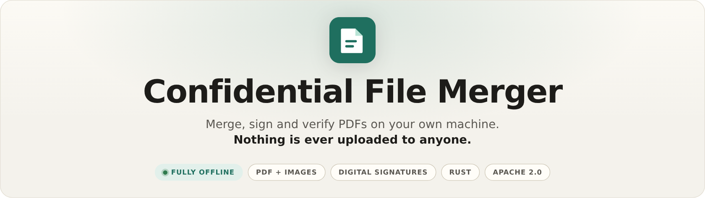
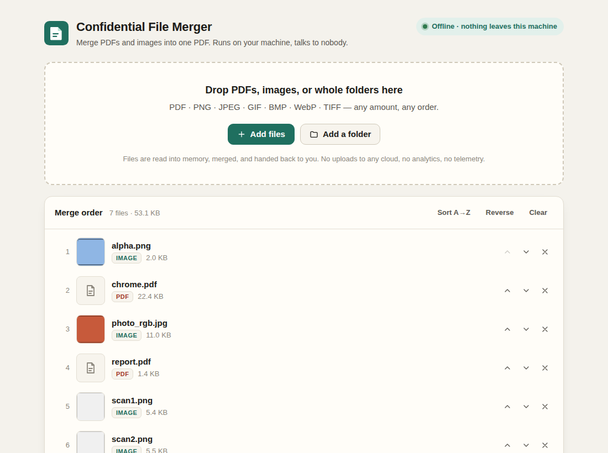
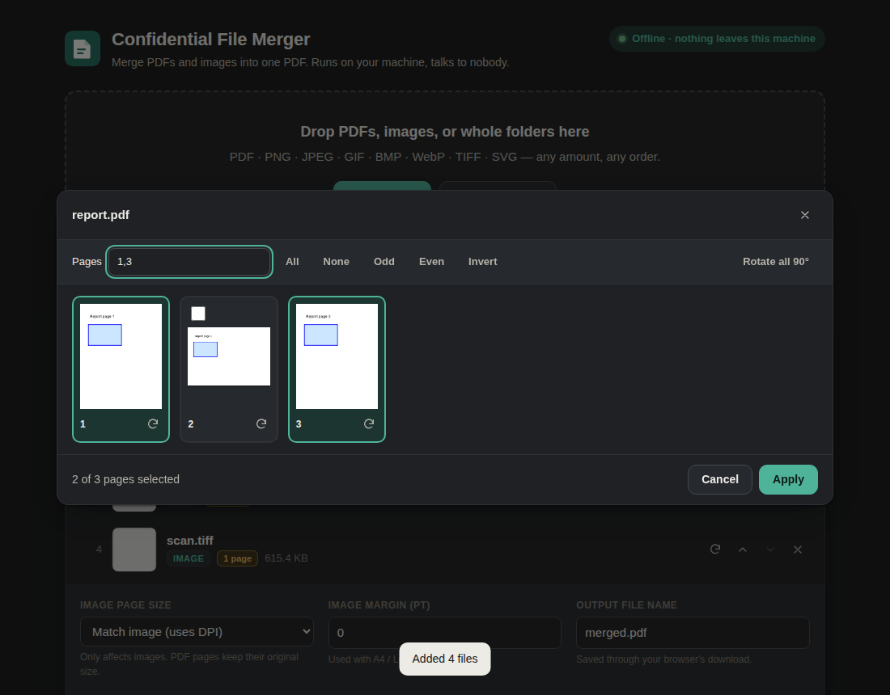
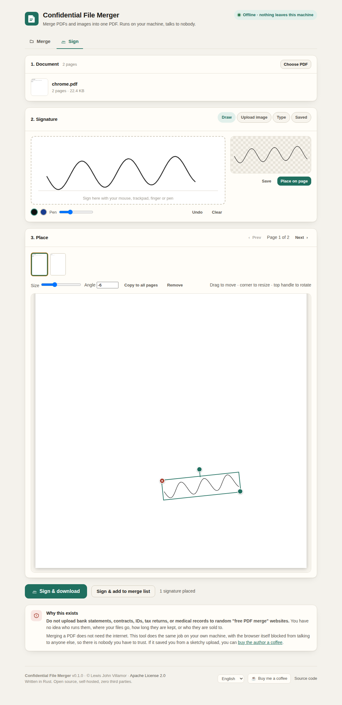
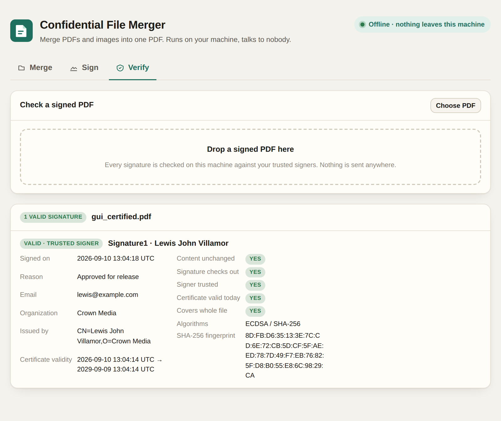

<p align="center">
  <picture>
    <source media="(prefers-color-scheme: dark)" srcset="docs/banner-dark.png">
    
  </picture>
</p>

> **Do not upload your bank statements, contracts, IDs, tax returns, or medical records
> to random "free PDF merge" websites.** You have no idea who runs them, where your files
> go, how long they are kept, or who they are sold to. Merging a PDF does not need the
> internet. This tool does the same job on your own machine, with the browser itself
> blocked from talking to anyone else, so there is nobody you have to trust.

Merge PDFs and images into a single PDF, **fully offline**, on a machine you control.
One small Rust binary serves a drag-and-drop web GUI on `localhost`. Nothing is uploaded
to anyone, nothing phones home, nothing is logged about your documents.



## What it does

- **Zero third parties.** Files are processed in memory by the local process and handed
  straight back to your browser. The page ships a strict Content-Security-Policy so the
  browser itself refuses to talk to any origin other than the local server.
- **PDF + images together.** PDF, PNG, JPEG, GIF, BMP, WebP, TIFF (multi-page) and SVG, in
  any mix and order. JPEGs are embedded byte-for-byte; other images are stored losslessly.
- **Pick pages, rotate, reorder.** A page picker with thumbnails for every PDF: choose
  pages by clicking or by range (`1-3, 5, odd`), rotate single pages or whole files, put
  pages in any order, even use a page twice.
- **Previews.** Every PDF and TIFF gets a real rendered thumbnail and a page count as soon
  as you add it, so you can see what you are merging.
- **Passwords handled properly.** Owner-locked PDFs (common with bank statements) open
  transparently. User-locked PDFs ask for their password in the list; nothing is merged
  as garbage.
- **Keeps what matters.** Page sizes, rotation, links and annotations survive. Each file
  gets a bookmark, the source PDFs' own outlines are nested underneath with their internal
  links intact, and interactive form fields stay fillable (colliding names are renamed).
- **Smaller output.** Identical fonts and images shared by several inputs are stored once;
  uncompressed streams are compressed.
- **Correct physical size.** Image pages use the DPI declared by the file, so a 300 DPI
  scan becomes a letter-sized page instead of a poster.
- **Sign documents.** A separate Sign tab: draw a signature with mouse, trackpad, finger or
  pen, upload a photo or scan (the white paper becomes transparent), or type your name.
  Drag it onto the page, resize and rotate it, stamp it on every page, and download. The
  signature is embedded as a transparent PNG; nothing else on the page changes.
- **Real digital signatures, offline.** Create your own signing identity (an ECDSA P-256
  key and a self-signed X.509 certificate, encrypted with a passphrase and stored on this
  machine) and seal the file with a standard PKCS#7 signature that Acrobat and other
  readers understand. Any later change is detectable, several people can sign in sequence,
  and no certificate authority, timestamp service or internet connection is involved. If
  you do want a CA, the same identity can produce a signing request and install the
  certificate it gets back.
- **Verify signatures.** A Verify tab checks every signature in a PDF against your own
  trust list and reports who signed, when, why, whether the bytes are untouched and whether
  anything was appended afterwards.
- **Document properties.** Title, author, subject and keywords, set from the GUI or CLI.
- **Unlimited.** No file count, size, or "merges per day" limits. Merge, tweak the list,
  merge again. Feed the result back into the list and keep going.
- **Folders.** Drop a folder onto the page, pick one with the folder button, or (opt-in)
  point the server at a folder on its own disk. Files sort naturally (`scan1, scan2, scan10`).
- **Paste straight in.** Copy a screenshot or a file and press Ctrl+V (⌘V on a Mac). It
  lands wherever you are: in the merge queue, as your signature on the Sign tab, or
  checked on the spot on the Verify tab.
- **Comfortable.** Live progress for big merges, duplicate detection, your list survives
  a page refresh (kept in the browser only, passwords excluded), full keyboard control,
  English and Spanish, light and dark themes.
- **Hostable.** Optional access token, HTTPS (bring a certificate or generate one),
  concurrency cap, health endpoint, JSON logs, Docker image, prebuilt binaries.
- **Also a CLI.** The same binary merges from the terminal for scripts and cron jobs.

## Quick start

### Prebuilt binary

Download the archive for your platform from the
[releases page](https://github.com/lewisjohnvillamor/Confidential_file_merger/releases),
verify it (see [Verifying a download](#verifying-a-download)), unpack, and run:

```sh
./confidential_file_merger --open
```

`--open` launches your browser at <http://127.0.0.1:8080/>. That's it. The binary is
self-contained; copy it anywhere and run it.

### From source

You need a Rust toolchain (1.85 or newer, <https://rustup.rs>). No other dependencies,
no system libraries, no JavaScript build step.

```sh
git clone https://github.com/lewisjohnvillamor/Confidential_file_merger.git
cd Confidential_file_merger
cargo build --release --locked
./target/release/confidential_file_merger
```

```text
Confidential File Merger v0.1.0
  GUI:            http://127.0.0.1:8080/
  Access:         open to anyone who can reach this address
  TLS:            off (fine on localhost; use --tls-self-signed on a LAN)
  Local folders:  disabled (pass --allow-local-folders to enable)
  Upload limit:   unlimited
  Concurrency:    2 merge(s) at a time
  Network:        none. Files are processed in memory and never leave this machine.
```

## Using the GUI

1. Drop files or folders onto the page, use **Add files** / **Add a folder**, or paste an
   image or PDF from the clipboard with Ctrl+V. PDFs and TIFFs show a rendered preview and
   their page count. A locked PDF shows a password box.
2. Arrange the list: drag rows, use the arrow buttons, **Sort A→Z**, or **Reverse**.
   The list order is the page order.
3. Per file: **rotate** (↻) the whole file, or open the **page picker** (grid icon) to
   tick pages, type a range such as `1-3, 5, odd`, and rotate individual pages.

   
4. Choose how images are placed (match image size using its DPI, A4, or US Letter with
   optional margin), the output file name, and optionally document properties and the
   advanced switches (bookmarks, source outlines, form fields, de-duplication).
5. **Merge to PDF**. Progress shows which file is being read. The result downloads through
   your browser. The list stays, so you can adjust and merge again, or press
   **Add result to list** to chain merges.

Keyboard: focus a row and use **Alt+↑/↓** to move it, **R** to rotate, **P** for the page
picker, **Delete** to remove, **↑/↓** to move between rows. **Ctrl+V** anywhere outside a
text box pastes a copied image or PDF into the tab you are on. Screen readers get the same
announcements.

### Signing

Open the **Sign** tab.

1. **Document.** Choose or drop the PDF (or press *Use last merged result*). Every page is
   rendered so you can see where you are signing.
2. **Signature.** *Draw* on the pad (pen colour and width are adjustable, with undo),
   *Upload* a photo or scan (turn *Remove white background* on and tune the threshold
   until only the ink remains), paste one with Ctrl+V, or *Type* your name in a script face. Press **Save** to keep
   a signature in this browser for next time; saved signatures never leave the device.
3. **Place.** Pick the page from the strip, press **Place on page**, then drag the
   signature where it belongs. The corner handle resizes it (aspect ratio is kept), the top
   handle rotates it (hold Shift for 15° steps), and the toolbar offers exact size, angle,
   *Copy to all pages* and *Remove*. Arrow keys nudge a selected signature; `+`/`-` resize;
   `R` rotates.
4. **Sign & download**, or **Sign & add to merge list** to continue in the Merge tab.



Signatures are stamped as transparent images with a soft mask, so they sit cleanly over
text and lines. The placement follows the page exactly as displayed, including pages that
carry a rotation. On its own this is a visual signature: it looks like ink on paper and
proves about as much.

### Digital certificates

Section **4. Digital certificate** of the Sign tab turns that ink into a cryptographic
signature. Tick *Also sign with a certificate*, pick an identity, type its passphrase, and
the downloaded PDF carries a standard detached PKCS#7 (`adbe.pkcs7.detached`) signature
over the whole file. Readers that understand PDF signatures show the signer, the time and
whether the document has been altered; the first stamp you placed becomes the visible
signature box, and with no stamp at all the signature is invisible but still there.

**This is completely offline.** A digital signature is arithmetic on a private key you
hold, not a call to a service. Press *Manage identities…* and *Create identity* to make
one: the app generates an ECDSA P-256 key, wraps it in a self-signed certificate with your
name, email and organisation, encrypts the key with your passphrase (PKCS#8, PBES2) and
writes it to the data folder shown at the bottom of that dialog. Nothing leaves the
machine, and the same is true of signing and of verification.

A self-signed certificate is trusted by the people you give it to, and nobody else — the
same trust model as an SSH key. Press *Download certificate* and hand the `.crt` file to
whoever needs to check your signatures; they add it under *Trusted signers*. Your own
identities are always trusted on your own machine.

If you need a signature that strangers' PDF readers trust automatically, that is exactly
what a certificate authority sells. The identity you just made can ask one: *Request from
a CA…* writes a certificate signing request (CSR) for the same key, and *Install CA
certificate…* replaces the self-signed certificate with the one the authority issues. The
key never moves. You can also *Import* a certificate and key you already own (a
personal/eID certificate, a company code-signing key) as PEM.

### Verifying



The **Verify** tab takes any PDF and reports, for every signature it finds: the signer's
name, email, organisation and certificate fingerprint, the signing time, reason and
location, whether the signed bytes are unchanged, whether the signature itself checks out,
whether the certificate is currently valid, whether the signature covers the whole file,
and whether the signer is in your trust list. A valid signature from someone you have not
trusted yet offers a *Trust this signer* button. Everything is computed locally.

Notes on what the guarantees mean:

- **Content unchanged / signature checks out** are the cryptographic facts: the SHA-256
  digest over the signed byte ranges matches and the signature verifies against the
  certificate's public key. Change one byte of the document and both fail.
- **Signer trusted** is your decision, not maths. It only means the certificate (or its
  issuer) is in your trust list.
- **Covers whole file** is false for every signature except the last one when a document
  has been signed more than once — each new signature is appended, so earlier ones cover
  less than the current file. That is normal and expected.
- There is no timestamp authority, so the signing time is the signer's own clock, and
  signatures are not "long-term validation" (LTV) material. That is the price of never
  talking to anybody; for most private documents it is the right trade.

## Server options

```text
confidential_file_merger [OPTIONS] [COMMAND]

Options:
  --host <HOST>                    Address to listen on [default: 127.0.0.1]
  --port <PORT>                    Port to listen on [default: 8080]
  --open                           Open the GUI in the default browser once listening
  --access-token <TOKEN>           Require this shared secret (entered once in the browser)
  --tls-cert <FILE> --tls-key <FILE>
                                   Serve HTTPS with your own PEM certificate and key
  --tls-self-signed                Serve HTTPS with a certificate generated at startup
  --allow-local-folders            Let the GUI read folders from the *server's* disk by path
  --folder-root <DIR>              With --allow-local-folders, only allow paths under DIR
  --max-upload-mb <MB>             Cap the total upload size per merge (0 = unlimited)
  --max-concurrent-merges <N>      Merges allowed at the same time; others wait [default: 2]
  --log-format <text|json>         Log line format [default: text]
  --data-dir <DIR>                 Where signing identities and trusted certificates live
                                   [default: the platform config folder]
```

Every option can also be set with an environment variable: `CFM_HOST`, `CFM_PORT`,
`CFM_ACCESS_TOKEN`, `CFM_TLS_CERT`, `CFM_TLS_KEY`, `CFM_TLS_SELF_SIGNED`,
`CFM_ALLOW_LOCAL_FOLDERS`, `CFM_FOLDER_ROOT`, `CFM_MAX_UPLOAD_MB`,
`CFM_MAX_CONCURRENT_MERGES`, `CFM_LOG_FORMAT`, `CFM_DATA_DIR`.

Identities and trusted certificates are kept in `--data-dir`, by default
`~/.config/confidential_file_merger` on Linux,
`~/Library/Application Support/confidential_file_merger` on macOS and
`%APPDATA%\confidential_file_merger` on Windows. Private keys are stored encrypted, with
file permissions `0600` on Unix. Back that folder up (and keep the backup as safe as the
passphrase); delete it to forget every identity. In Docker, mount it as a volume if you
want identities to survive the container.

`GET /healthz` answers `{"status":"ok"}` without authentication, for container health checks.

### Merging folders from the server's disk

When the browser and the server run on the same machine (or the files are simply too big
to push through a browser upload), start with:

```sh
confidential_file_merger --allow-local-folders --folder-root ~/Documents
```

A **Merge a folder from this server's disk** section appears in the GUI. Type a path,
optionally include sub-folders, and **Scan & add**. The server reads those files directly.
This is off by default because it lets anyone who can reach the GUI read files the process
can read. Always pair it with `--folder-root` if the server is reachable by others.

### Hosting for a household or team

Bind to a LAN interface, require a token, and serve HTTPS so uploads are not readable on
the network:

```sh
confidential_file_merger --host 0.0.0.0 --access-token 'a long random phrase' --tls-self-signed
```

Browsers warn once about the self-signed certificate; accept it, then enter the token.
For a real certificate use `--tls-cert fullchain.pem --tls-key privkey.pem`. The token is
compared in constant time and kept in an `HttpOnly` cookie; scripts can send it as
`Authorization: Bearer <token>` instead.

Or with Docker:

```sh
docker build -t confidential-file-merger .
docker run --rm -p 8080:8080 -e CFM_ACCESS_TOKEN=secret confidential-file-merger
# or the published image
docker run --rm -p 8080:8080 ghcr.io/lewisjohnvillamor/confidential-file-merger:latest
```

The container needs no outbound network. The app deliberately has no user accounts:
the access token plus network reachability are the access control.

## Command line

```sh
# Files and folders, in order. Folders are scanned in natural sort order.
confidential_file_merger merge -o bundle.pdf cover.pdf scans/ appendix.png

# Pages 1-3 and 7 of the report (rotated 90°), then page 2 of the statement (with its
# password), then a whole folder including sub-folders, on A4 with a 1/2 inch margin.
confidential_file_merger merge -r --page-size a4 --margin 36 -o all.pdf \
  'report.pdf?pages=1-3,7&rotate=90' 'statement.pdf?pages=2&password=hunter2' ./inbox

# Document properties and switches.
confidential_file_merger merge -o out.pdf --title "Q1 pack" --author "Ana" \
  --no-source-outlines --ignore-image-dpi a.pdf b.pdf
```

```sh
# Stamp a signature image on the last page, 25% of the page width, centred at 70%/85%.
confidential_file_merger sign -o signed.pdf contract.pdf --signature sig.png
# Every page, top-left, a little smaller, tilted, on a password-protected file.
confidential_file_merger sign -o signed.pdf 'form.pdf?password=x' --signature initials.png \
  --pages all --at 0.15,0.1 --width 0.12 --angle -5
```

```sh
# Make a signing identity once (the passphrase can come from CFM_PASSPHRASE instead).
confidential_file_merger identity create --name 'Lewis John Villamor' \
  --email lewis@example.com --organization 'Example Ltd' --passphrase 'a long passphrase'
confidential_file_merger identity list

# Sign with the certificate; --signature is optional (without it the signature is invisible).
confidential_file_merger sign -o signed.pdf contract.pdf --signature sig.png \
  --identity 'Lewis John Villamor' --passphrase 'a long passphrase' \
  --reason 'I approve this document' --location Manila

# Check a file. Exit code 0 = every signature valid, 2 = invalid or unsigned.
confidential_file_merger verify signed.pdf
confidential_file_merger verify signed.pdf --json

# Share your certificate; trust someone else's.
confidential_file_merger identity export-cert <id> > lewis.crt
confidential_file_merger trust add theirs.crt
confidential_file_merger trust list

# Ask a certificate authority for a real certificate for the same key.
confidential_file_merger identity csr <id> --passphrase '…' > lewis.csr
confidential_file_merger identity install <id> --cert from-ca.crt --passphrase '…'
```

Per-file options after `?`: `pages=` (ranges, `odd`, `even`, `last`; either direction),
`rotate=` (whole file), `rotateN=` (page N), `password=`. `--password` applies to every
encrypted input. `--no-bookmarks`, `--no-source-outlines`, `--no-forms`, `--no-optimize`,
`--ignore-image-dpi` switch off the corresponding behaviours.

Exit code is non-zero with a one-line reason if any input cannot be used.

## HTTP API

Everything the GUI does goes through a small JSON/multipart API you can script:

| Endpoint | Purpose |
| --- | --- |
| `POST /api/merge` | Multipart `file`/`path` fields in order plus `page_size`, `margin`, `output_name`, `password`, or a `manifest` JSON field. Responds with the PDF. |
| `POST /api/jobs` | Same form, returns `{id}` at once. `GET /api/jobs/{id}` reports `queued`/`running` (step, total, label)/`done`/`error`; `GET /api/jobs/{id}/result` returns the PDF once and forgets the job. Jobs expire after 15 minutes. |
| `POST /api/inspect` | One `file`/`path`, optional `password`, `thumbs=none\|first\|all`, `page=N` for one page, `max_edge`, `max_pages`. Returns page count, encryption state, page sizes and PNG thumbnails. |
| `POST /api/sign` | The PDF as `file`/`path`, optional `password`, one or more `signature` images, and a `manifest` with `placements` (`page`, `image`, `cx`, `cy`, `width`, `height` as fractions of the displayed page, `angle` in degrees), `output_name`, and optionally `certify` (`identity`, `passphrase`, `reason`, `location`, `contact`, `visible`) to add a certificate signature. Responds with the signed PDF. |
| `POST /api/verify` | One `file`/`path`, optional `password`. Returns a JSON report of every signature: signer certificate details, times, integrity, trust, and problems. |
| `GET/POST /api/identities` | List identities, or create one from `{name, email, organization, country, passphrase, valid_days}`. `POST /api/identities/import` takes `{cert_pem, key_pem, key_passphrase, passphrase}`. |
| `DELETE /api/identities/{id}` | Forget an identity and its key. `GET .../certificate` downloads the certificate (PEM), `POST .../csr` returns a signing request, `POST .../install` installs a CA-issued certificate. |
| `GET/POST /api/trust` | List trusted certificates, or trust one with `{cert_pem}`. `DELETE /api/trust/{fingerprint}` removes it. |
| `POST /api/folder/scan` | `{"path": "...", "recursive": false}` (opt-in). |
| `POST /api/login`, `POST /api/logout` | Token cookie handling. `GET /api/config` describes the server. |

The manifest carries per-item settings (`pages` as a range string or array, `rotate`,
`page_rotations`, `password`) matched by position to the files, plus the global options.

## How it works

- **PDFs** are parsed with [`lopdf`](https://crates.io/crates/lopdf), a pure-Rust PDF
  library. Pages are re-parented into a fresh page tree; attributes inherited from the
  original tree (media box, crop box, rotation, resources) are copied down first so nothing
  is lost. Named destinations are resolved to explicit ones before the source catalog is
  dropped, so outline entries and internal links keep working. Form fields are gathered
  into one AcroForm. Unreachable objects are pruned; identical streams are shared.
- **Images** are decoded with the [`image`](https://crates.io/crates/image) crate
  (`tiff` for multi-page TIFF, `resvg` for SVG) and embedded as PDF image XObjects. JPEG
  data is passed through untouched (DCTDecode); everything else becomes 8-bit Gray or RGB
  with Flate compression. Transparency is composited onto white.
- **Previews** are rendered by [`hayro`](https://crates.io/crates/hayro), a pure-Rust PDF
  rasteriser, so no browser plugin or external program is involved.
- **Web server** is [`axum`](https://crates.io/crates/axum) with `rustls` for TLS. The GUI
  is a single HTML file compiled into the binary; it loads no external fonts, scripts, or
  styles.
- **Digital signatures** use the [RustCrypto](https://github.com/RustCrypto) stack:
  `x509-cert` for certificates and signing requests, `p256`/`rsa` for keys, `pkcs8` for the
  encrypted key files, `cms` for the PKCS#7 SignedData blob and `sha2` for the digests. The
  signature is added as an incremental update: the original bytes are left untouched, a
  signature dictionary with a `/ByteRange` and a `/Contents` placeholder is appended, then
  the placeholder is filled with the CMS structure computed over those exact ranges. That
  is why an earlier signature stays valid when a second person signs.

## Privacy checklist

| Concern | Answer |
| --- | --- |
| Are files uploaded anywhere? | Only to the server you started, over the address you chose. Default is `127.0.0.1`, unreachable from other machines. |
| Does the page load anything remote? | No. CSP `connect-src 'self'` makes the browser block it even if a bug tried. |
| Are files written to disk? | No. Merging happens in memory. Downloads are written by *your* browser. The queue that survives a refresh lives in your browser's own storage, never on the server, and never includes passwords. The one exception is what you ask to be saved: signing identities and trusted certificates, in the data folder. |
| Do digital signatures need the internet? | No. Keys are generated, used and checked locally. There is no certificate authority, no timestamp server and no revocation lookup. |
| Where does my private key go? | Nowhere. It stays in the data folder, encrypted with your passphrase, and is decrypted in memory only for the moment of signing. The passphrase is never stored. |
| Is anything logged? | One line per merge with the number of inputs and byte sizes. Never file names or content. |
| Telemetry, analytics, update checks? | None. |

The only outbound links in the GUI are the license text, the source repository and the
donation link, and those open only when you click them.

## Verifying a download

Each release ships `SHA256SUMS` alongside the archives. After downloading:

```sh
sha256sum -c SHA256SUMS --ignore-missing      # Linux
shasum -a 256 -c SHA256SUMS --ignore-missing  # macOS
Get-FileHash .\confidential_file_merger-*.zip # Windows (compare by eye)
```

Releases are built by the public GitHub Actions workflow in `.github/workflows/release.yml`
from the tagged commit with `cargo build --release --locked`, so the exact dependency set
is the committed `Cargo.lock`. To rebuild and compare, check out the tag, run the same
command on the same platform and toolchain, and hash the result.

## Development

```sh
cargo test                       # unit tests, including encrypted-PDF regression fixtures
cargo clippy --all-targets -- -D warnings
cargo run -- --port 8080 --allow-local-folders --folder-root .
```

The README banner is generated in two steps, both from a running app:

```sh
cargo run --release -- --port 8080
node docs/shoot-app.js      # captures the merge queue -> docs/banner-app-{light,dark}.png
node docs/render-banner.js  # frames it -> docs/banner-{light,dark}.png
```

`shoot-app.js` draws its own demo documents on a canvas and turns them into PDFs through
`/api/merge`, so the thumbnails in the banner are real renders and the repository carries
no demo binaries. `docs/banner.html` is the frame around them; edit it, re-render, and
commit the images.

CI runs formatting, clippy, tests and a release build on every push. Test fixtures under
`tests/fixtures/` are tiny PDFs with AES-256 encryption written by a third-party tool, used
to make sure owner-only encryption is opened and user-password encryption is refused or
unlocked with the right password.

## Not (yet) included

- **HEIC and AVIF photos.** No pure-Rust decoder exists for them; convert to JPEG first.
- **PDF/A output.** Proper PDF/A needs font embedding checks and colour profiles; this
  tool preserves whatever the inputs contain rather than claiming conformance.
- **PAdES long-term validation.** Signatures are standard CMS, but there is no trusted
  timestamp, no OCSP/CRL evidence and no signed document timestamp, because collecting
  those means talking to servers. Signatures verify on their own merits, not against a
  chain of dated authorities.
- **Smart cards and hardware tokens.** Keys are software keys in the data folder; PKCS#11
  devices are not driven yet.
- **A desktop app wrapper and an in-browser (WebAssembly) mode.** The engine is written to
  allow both; they are separate build targets and not part of this release.

## Support the project

If this saved you from uploading a confidential document to a random website, consider
buying the author a coffee: <https://buymeacoffee.com/lewisjohnvil>

## License

Copyright 2026 Lewis John Villamor.

Licensed under the [Apache License, Version 2.0](LICENSE).
